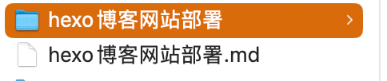

# 使用hexo部署个人博客

## 本地安装nodejs
可以选择下载最新几个版本的node进行安装
[node官网](https://nodejs.org/en)

## 安装并初始化hexo
1、切换到root用户
```shell
sudo su
```
> 或者某个普通文件夹下也可以

2、全局安装hexo-cli

```shell
npm i -g hexo-cli
```

查看版本
```shell
hexo -v
```

3、在root目录（或者某一个普通目录下）下创建一个blog目录
```shell
mkdir blog

# 切换到blog目录
cd blog
```

4、在blog目录下初始化hexo

```shell
sudo hexo init
```

> 或者上面3、4步可以简写为`hexo init blog`，表示使用hexo初始化一个文件夹

5、本地启动hexo

切换到博客项目文件下
```shell
cd blog
```

```shell
hexo server
```
此时便可以访问本地的博客网站了

## 写文章
1、切换到/blog/source/_posts目录下写文章
```
cd source/_posts
```

2、 创建一篇文章(默认生成的是md文档)
```shell
# 会自动创建一个以md为后缀的文件，即markdown
hexo new '我的第一篇博客'

# 简写如下
hexo n '我的第一篇博客'
```

3、编辑博客文章,使用markdown语法编辑文章
```shell
vim 我的第一篇博客.md
```
或者可以打开ide软件进行编辑也可以

4、保存博客并生成静态文件 

使用qw:命令保存退出后,切换到blog目录下，使用命令生成文章
```shell
# 退出编辑模式
qw:

# 切换回blog目录
cd ../..

# 根据md文档生成html静态文件
hexo generate
# 下面是简写
hexo g
```

## 修改一些简单的配置
打开blog/_config.yml文件

修改整个网站/个人的相关信息，修改如下
```
# Site
title: who's blog       # 网站的名字
subtitle: ''            # 网站的副标题
description: 'coding'   # 个人描述
keywords:               # seo 关键词
author: Nick Deng       # 网站作者
language: zh-hans       # 使用的语言，这个是简体汉语
timezone: ''            # 时间
```

## 将网站部署到github
1、在github上创建一个新的仓库，仓库名字必须如下格式
``` shell
你的github名.github.io
```

2、安装一键部署的插件
```shell
npm i --save hexo-deployer-git
```
该插件用于部署hexo到github上


3、编辑blog/_config.yml文件
```shell
vim _config.yml
```

在文件底部的Deployment项中进行配置，添加如下内容
```shell
Deployment
deploy:
	type: git
	repo: xxx.git  // 这个是github仓库地址，可以是https/SSH
	branch: master // 注意每一个冒号后面都有一个空格
```

4、开始部署博客项目
```shell
hexo clean ## 先清除一下旧的静态文件
hexo g ## 生成新的静态文件

# 部署
hexo deploy ## 部署命令
hexo d ## 部署命令简写
```
如果是使用的https方式，则每次上传博客时候都要要输入临时访问令牌，而SSH方式只需要配置一次私钥和公钥，每次提交博客就不用输入用户名和密码了

## 使用别人的博客主题
1、切换到blog目录下，下载主题
```shell
git clone xxx

## 这里可以推荐一个主题（这里用的是社区维护版本）
## git clone https://github.com/theme-next/hexo-theme-next themes/next themes/next
## themes/next 是要将克隆的仓库放置在本地的路径。这里指定将主题放置在名为 "next" 的目录下（相对于当前工作目录）。
## 该主题下又有不同的外观可以选择
具体可以看官方：https://github.com/iissnan/hexo-theme-next（已停止维护）
```

2、打开网站配置文件blog/_config.yml，修改默认主题
```
# Extensions
## Plugins: https://hexo.io/plugins/
## Themes: https://hexo.io/themes/
## theme: landscape   ## 这个是默认主题
theme: next ## 这个是next主题
```

3、添加搜索功能
(1)安装搜索插件hexo-generator-searchdb 
```
npm install hexo-generator-searchdb --save
```

(2)在网站配置文件_config.yml任意合理位置添加如下内容，打开博客搜索功能
```
# search
search:
  path: search.xml
  field: post
  format: html
  limit: 10000
```
(3)在主题配置文件_config.yml修改如下内容

找到Local search，将enable设置为true
```
Local search
	enable: true
```

4、打开主题配置文件`/blog/themes/next/_config.yml`，修改或者添加相关内容

修改next主题下的主题
```
# Schemes
#scheme: Muse
#scheme: Mist
#scheme: Pisces
scheme: Gemini
```

修改网站icon和个人头像等信息
```
favicon:
  small: /images/favicon-16x16.ico # 小型设备icon
  medium: /images/favicon-32x32.ico # 中形设备icon
  apple_touch_icon: /images/apple-favicon-128x128.ico # 苹果移动设备icon
  safari_pinned_tab: /images/logo.svg # safari浏览器使用的icon
  #android_manifest: /images/manifest.json # 安卓缓存文件
  #ms_browserconfig: /images/browserconfig.xml
```
上述这些图标文件保存在`blog/themes/next/sources/images`下面

修改侧边栏设置
```
sidebar:
  # Sidebar Position.   # 网站侧边栏位置靠左边还是靠右边
  position: left
  #position: right
	
  # 侧边栏宽度
  # Manual define the sidebar width. If commented, will be default for:
  # Muse | Mist: 320
  # Pisces | Gemini: 240
  #width: 300

  # 侧边栏显示方式
  # Sidebar Display (only for Muse | Mist), available values:
  #  - post    默认，在文章页面中又目录时显示
  #  - always  全部页面中展示侧边栏
  #  - hide    在所有页面中隐藏侧看栏，可手动打开
  #  - remove  彻底移除侧边栏
  display: hide

  # Sidebar padding in pixels. 侧边栏内边距
  padding: 18
  # Sidebar offset from top menubar in pixels (only for Pisces | Gemini).
  offset: 12
  # Enable sidebar on narrow view (only for Muse | Mist).
  onmobile: false
```
## 添加其他侧边栏项

1、切换到/blog下执行如下命令
```
hexo new page 'categories'
hexo new page 'tags'
hexo new page 'about'
```
执行完上述命令后就在/source/_posts下创建几个相应的文件夹
打开各自的index.md文件，以categories/index.md威力，添加以下内容后
```
---
title: 文章分类
date: 2023-09-07 10:13:21
type: "categories"
---
```
tags页面同理

3、接下来打开主题配置文件，把要用到的页面注释解开，改成如下：
```
menu:
  home: / || fa fa-home                     # 主页
  about: /about/ || fa fa-user              # 关于页
  tags: /tags/ || fa fa-tags                # 标签页
  categories: /categories/ || fa fa-th      # 分类页
  archives: /archives/ || fa fa-archive     # 归档页
  #schedule: /schedule/ || fa fa-calendar   # 计划页
  #sitemap: /sitemap.xml || fa fa-sitemap   # 时间
  #commonweal: /404/ || fa fa-heartbeat     # 公益404

# Enable / Disable menu icons / item badges.
menu_settings:
  icons: true
  badges: false
```

4、完成以上操作后，即可在categories页面中呈现分类，在tags页面中展示所有标签

## 博客文章写作配置
### 博客信息
```
---
title: 文章标题
date: 2023-09-07 09:37:55 写作日期
tags: 标签1
categories: 目录1
description: 博客简介，在主页上就会只显示博客简介，点击博客后才可以阅读全篇内容
---
```

tags和categories的写法
```
// 这是默认的写法，给文章添加一个分类。
categories: 123

// 将文章分类到123的子目录456下。
categories: [123, 456]

// 会将文章分类到123的子目录456下。
categories:
   - 123
   - 456

// 多标签写法，文章被分类到123、456以及123的子目录789这3个目录下面，官方指定写法。
categories:
   - [123]
   - [456]
   - [123, 789]

```


如果只想让人在主页阅读博客部分内容，并显示`阅读全文`的按钮，那么可以使用`<!--more-->`，同时修改主题配置文件，即只可以读到该代码前面的博客内容，修改内容如下：
```
# Automatically excerpt description in homepage as preamble text.
excerpt_description: true

# Read more button
# If true, the read more button will be displayed in excerpt section.
read_more_btn: true
```

### 超链接
```
[网站名称](网站链接)

或者
<网站链接>

抑或者引用出现过的链接
[网站名称][出现过的网站名称]
```

### 修改链接样式

打开文件`themes/next/source/css/_common/components/post/post.styl`，在末尾添加
```
.post-body p a {
  color: #0593d3;
  border-bottom: none;
  border-bottom: 1px solid #0593d3;
  &:hover {
    color: #fc6423;
    border-bottom: none;
    border-bottom: 1px solid #fc6423;
  }
}
```

## 其他一些功能
### 打赏功能
打开主题配置文件
```
reward_settings:
  # If true, a donate button will be displayed in every article by default.
  enable: true
  animation: false
  comment: Q：如果本文对你有用，小小的意思一下啦(*￣3￣)╭♡

reward:
  wechatpay: /images/wechatpay.png
  alipay: /images/alipay.png
```

### 版权申明
打开主题配置文件/blog/themes/next/_config.yml
```
# Creative Commons 4.0 International License.
# See: https://creativecommons.org/about/cclicenses/
# Available values of license: by | by-nc | by-nc-nd | by-nc-sa | by-nd | by-sa | zero
# You can set a language value if you prefer a translated version of CC license, e.g. deed.zh
# CC licenses are available in 39 languages, you can find the specific and correct abbreviation you need on https://creativecommons.org
creative_commons:
  license: by-nc-sa
  sidebar: true #侧边栏中的版权标识
  post: true #每篇文章底部都显示版权信息
  language:
```

### 图片粘贴上传

> 注意：我这里md文档编辑使用的工具是typora，同时在typora的设置里设置好了图片保存路径是当前文件同级目录下，例如：有一个test.md文档，那么该文档相关的图片全部保存在和test.md同级的test目录下，也就是/test/xxx.png，这里图片保存位置可以在typora的设置里面修改，如果是其他编辑器，那么你也同样需要把图片保存路径改下
>
> 


1、安装hexo-renderer-marked插件

```
npm i hexo -renderer-marked --save
```

2、**blog/_config.yml  => post_asset_folder: true**
开启这个配置后，每次`hexo n md文档`,都会在同级生成一个以**md文档名**为名的文件夹，用来保存md中的静态资源文件，例如图片，当然这里的文件夹也可以手动创建，但需要与md文档同名

``

3、可以发现，经过`hexo g`后，图片文件会和生成的静态index.html保存在同一级目录下，`/blog/public/2023/09/08`下可以看到。

而每次粘贴图片会自带前缀，例如`test/xxx.png`，这样的结果就是我们可以在本地看到图片，但却无法在部署后看到图片，解决方法是，修改脚本自动去除前缀，让文件在部署之后能访问到图片，到/node_modules/hexo-renderer-marked/lib/renderer.js下，添加去除前缀的代码即可，如下：

```js
// Prepend root to image path
  image(href, title, text) {
	console.log(href, " ========= ");
	if(href.indexOf('/')>-1){
		href = href.split('/')[1]
	}
	// ...
}
```